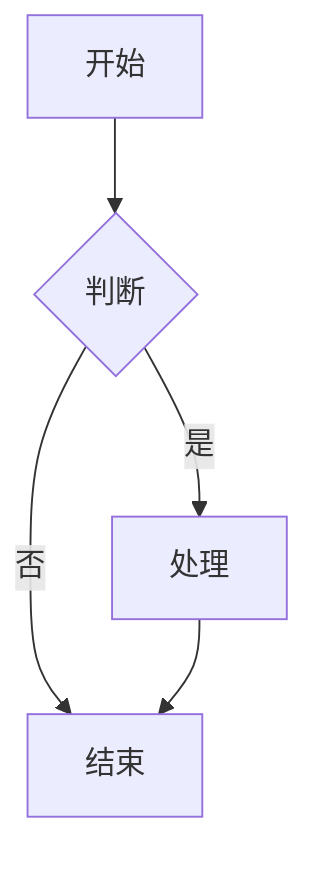
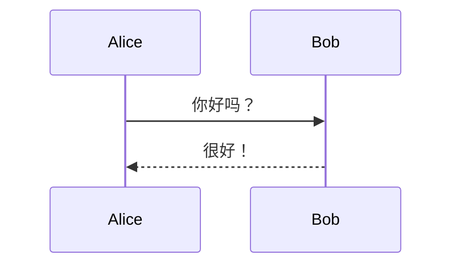
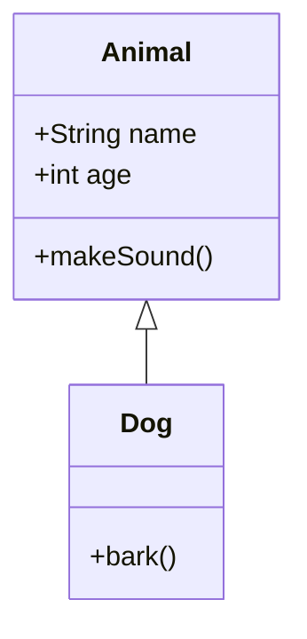
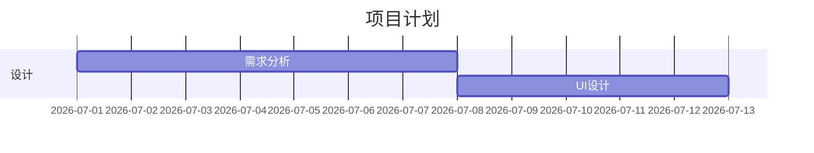
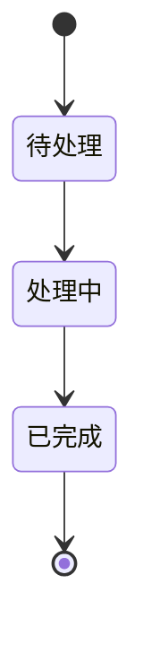
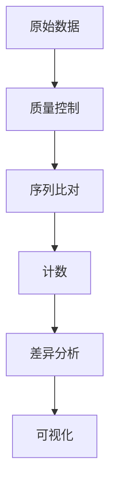

# 博客功能使用指南

本文档介绍如何在博客中使用 MathJax、Mermaid 和代码复制功能。

---

## 📐 MathJax 数学公式

### 启用方式

在文章的 Front Matter 中添加 `mathjax: true`：

```yaml
---
layout: post
title: "文章标题"
mathjax: true
---
```

### 使用语法

#### 1. 行内公式

使用 `$...$` 包裹公式：

```markdown
爱因斯坦质能方程：$E = mc^2$
```

效果：爱因斯坦质能方程：$E = mc^2$

#### 2. 块级公式

使用 `$$...$$` 包裹公式：

```markdown
$$
\int_{-\infty}^{\infty} e^{-x^2} dx = \sqrt{\pi}
$$
```

效果：
$$
\int_{-\infty}^{\infty} e^{-x^2} dx = \sqrt{\pi}
$$

#### 3. 多行公式

使用 `\begin{align}...\end{align}`：

```markdown
$$
\begin{align}
\nabla \cdot \mathbf{E} &= \frac{\rho}{\epsilon_0} \\
\nabla \cdot \mathbf{B} &= 0
\end{align}
$$
```

#### 4. 矩阵

```markdown
$$
\begin{pmatrix}
a & b \\
c & d
\end{pmatrix}
$$
```

### 常用数学符号

| 符号 | 代码 | 说明 |
|------|------|------|
| $\alpha, \beta, \gamma$ | `\alpha, \beta, \gamma` | 希腊字母 |
| $\sum, \prod, \int$ | `\sum, \prod, \int` | 求和、求积、积分 |
| $\frac{a}{b}$ | `\frac{a}{b}` | 分数 |
| $\sqrt{x}$ | `\sqrt{x}` | 根号 |
| $\mathbf{A}$ | `\mathbf{A}` | 向量/矩阵 |
| $\nabla$ | `\nabla` | 梯度算子 |
| $\partial$ | `\partial` | 偏导数 |

---

## 🎨 Mermaid 流程图

### 启用方式

在文章的 Front Matter 中添加 `mermaid: true`：

```yaml
---
layout: post
title: "文章标题"
mermaid: true
---
```

### 支持的图表类型

#### 1. 流程图 (Flowchart)

```markdown

```

**方向说明**：
- `TD` / `TB`：从上到下
- `BT`：从下到上
- `LR`：从左到右
- `RL`：从右到左

**节点形状**：
- `[矩形]`：矩形
- `(圆角矩形)`：圆角矩形
- `((圆形))`：圆形
- `{菱形}`：菱形（判断）
- `[[体育场形]]`：体育场形

#### 2. 时序图 (Sequence Diagram)

```markdown

```

**箭头类型**：
- `->>`：实线箭头
- `-->>`：虚线箭头
- `->>+`：激活生命线
- `-->>-`：结束激活

#### 3. 类图 (Class Diagram)

```markdown

```

#### 4. 甘特图 (Gantt Chart)

```markdown

```

#### 5. 状态图 (State Diagram)

```markdown

```

---

## 📋 代码复制按钮

### 自动启用

所有代码块都会自动添加复制按钮，无需手动配置。

### 使用示例

````markdown
```python
def hello():
    print("Hello, World!")
```
````

效果：代码块右上角会出现"📋 复制"按钮，点击即可复制代码。

### 支持的语言

支持所有编程语言的代码块，包括：
- Python
- R
- Bash/Shell
- JavaScript
- C/C++
- Java
- SQL
- 等等...

---

## 💡 最佳实践

### 1. 医学/生物信息学文章模板

```yaml
---
layout: post
title: "RNA-seq数据分析流程"
mathjax: true
mermaid: true
tags:
    - 生物信息学
    - RNA-seq
---

## 理论基础

差异表达分析的统计模型：

$$
\log_2(\text{FC}) = \log_2\left(\frac{\text{count}_{\text{treatment}}}{\text{count}_{\text{control}}}\right)
$$

## 分析流程



## 代码实现

```r
library(DESeq2)
# ... 代码示例 ...
```
```

### 2. 机器学习文章模板

```yaml
---
layout: post
title: "神经网络基础"
mathjax: true
mermaid: true
---

## 激活函数

Sigmoid 函数：

$$
\sigma(x) = \frac{1}{1 + e^{-x}}
$$

## 网络结构


```

---

## 🔧 故障排查

### MathJax 不显示？

1. 检查 Front Matter 是否添加 `mathjax: true`
2. 检查公式语法是否正确
3. 确保使用 `$...$` 或 `$$...$$` 包裹

### Mermaid 图表不显示？

1. 检查 Front Matter 是否添加 `mermaid: true`
2. 检查 Mermaid 语法是否正确
3. 确保使用 ` ```mermaid ` 代码块

### 代码复制按钮不工作？

1. 检查浏览器是否支持 Clipboard API
2. 尋试用现代浏览器（Chrome、Firefox、Edge）
3. 检查是否有 JavaScript 错误

---

## 📚 参考资源

- [MathJax 文档](https://docs.mathjax.org/)
- [Mermaid 文档](https://mermaid-js.github.io/mermaid/)
- [LaTeX 数学符号参考](https://oeis.org/wiki/List_of_LaTeX_mathematical_symbols)

---

**更新日期**：2026-07-01
**作者**：lyn