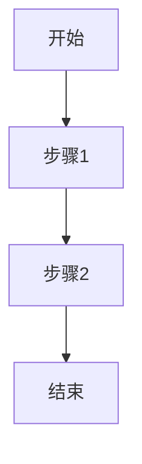
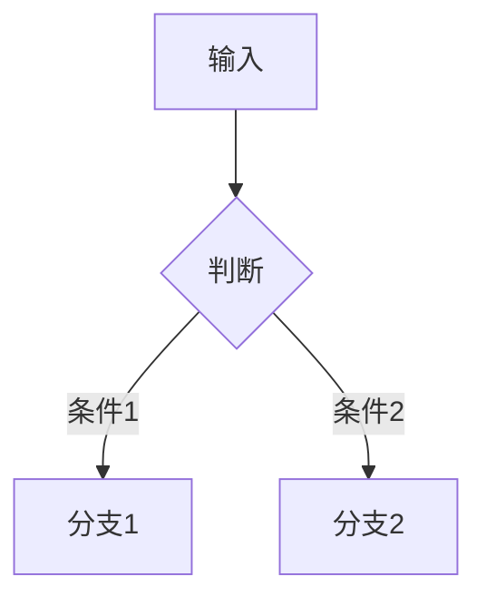
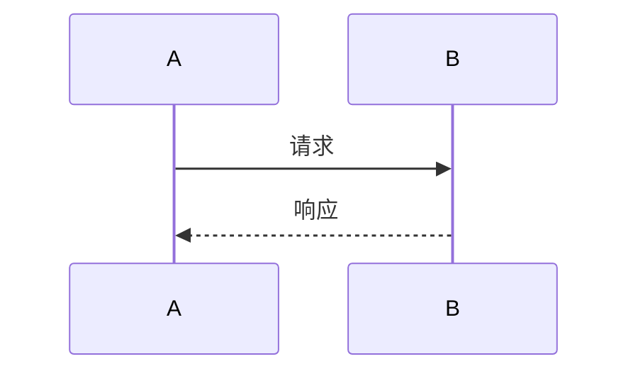

# 快速参考卡片

## 📐 MathJax 常用公式

### 基础语法
```markdown
行内：$公式$
块级：$$公式$$
```

### 常用公式模板

| 用途 | 代码 | 效果 |
|------|------|------|
| 分数 | `\frac{a}{b}` | $\frac{a}{b}$ |
| 根号 | `\sqrt{x}` | $\sqrt{x}$ |
| 求和 | `\sum_{i=1}^{n}` | $\sum_{i=1}^{n}$ |
| 积分 | `\int_{a}^{b}` | $\int_{a}^{b}$ |
| 希腊字母 | `\alpha, \beta, \gamma` | $\alpha, \beta, \gamma$ |
| 向量 | `\mathbf{x}` | $\mathbf{x}$ |
| 偏导 | `\frac{\partial f}{\partial x}` | $\frac{\partial f}{\partial x}$ |

### 生物信息学常用公式

```markdown
# 基因表达量
$$\text{TPM} = \frac{\text{reads}}{\text{length}} \times \frac{10^6}{\sum \text{normalized reads}}$$

# 差异表达
$$\log_2 \text{FC} = \log_2\left(\frac{\text{expression}_{\text{group1}}}{\text{expression}_{\text{group2}}}\right)$$

# p值校正
$$p_{\text{adj}} = p \times \frac{n}{\text{rank}(p)}$$
```

---

## 🎨 Mermaid 快速模板

### 1. 简单流程图


### 2. 判断流程


### 3. 生物信息学流程


### 4. 时序图


---

## 📋 代码块模板

### Python
```python
def function_name(param):
    """函数说明"""
    # 代码实现
    return result
```

### R (生物信息学)
```r
library(package_name)

# 数据处理
result <- function(data)

# 可视化
ggplot(data, aes(x, y)) + geom_point()
```

### Bash
```bash
# 单行命令
command input > output

# 多步骤流程
step1 | step2 | step3
```

---

## ✅ Front Matter 配置

```yaml
---
layout: post
title: "文章标题"
mathjax: true    # 启用数学公式
mermaid: true    # 启用流程图
tags:
    - 标签1
    - 标签2
---
```

---

**提示**：将此文件保存为书签，方便快速查阅！