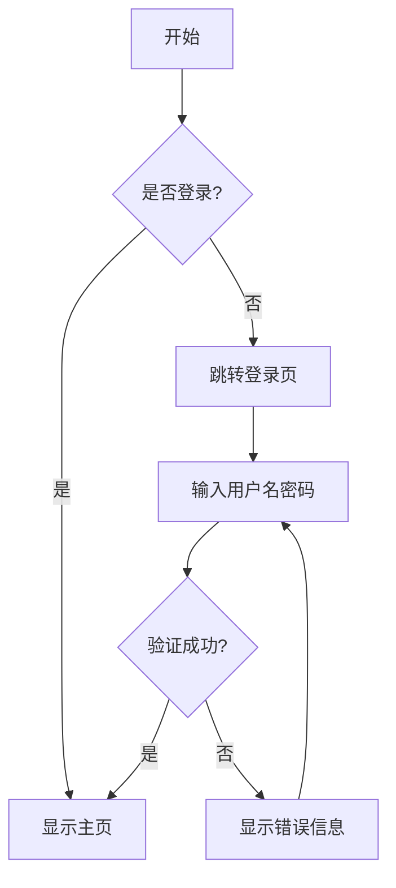
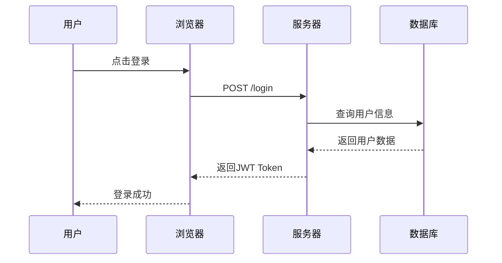
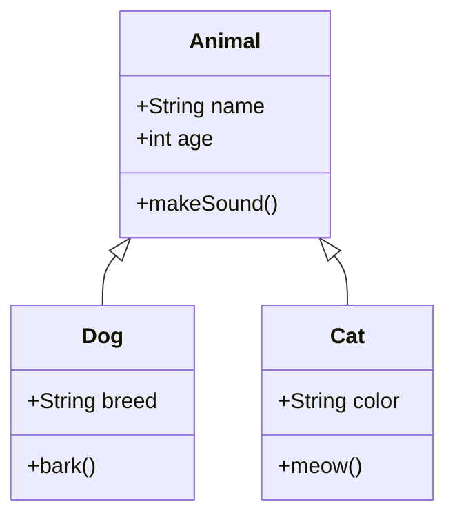
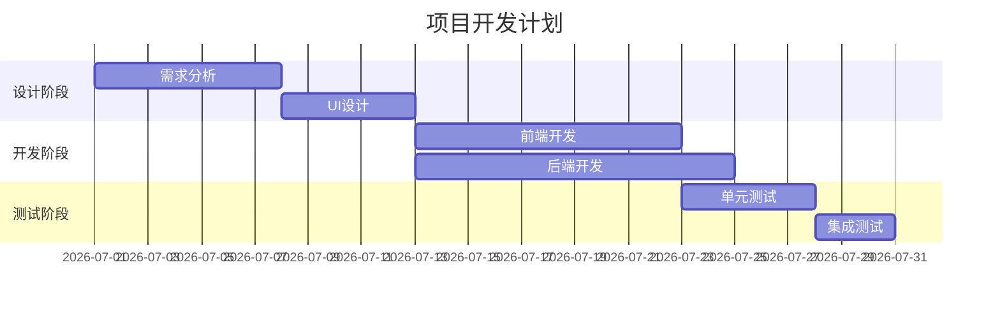
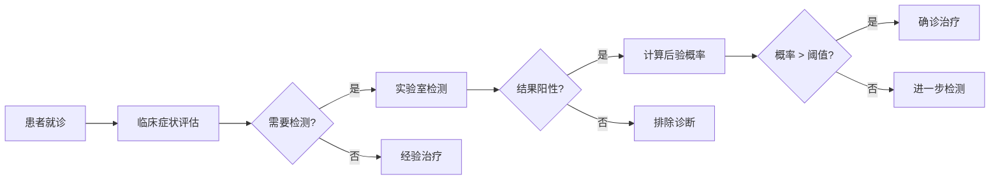

> 这篇文章测试博客的新功能：数学公式、流程图和代码复制按钮

## 一、数学公式测试（MathJax v3）

### 1. 行内公式

爱因斯坦的质能方程：$E = mc^2$，其中 $E$ 是能量，$m$ 是质量，$c$ 是光速。

### 2. 块级公式

高斯分布（正态分布）的概率密度函数：

$$
f(x) = \frac{1}{\sigma\sqrt{2\pi}} e^{-\frac{(x-\mu)^2}{2\sigma^2}}
$$

### 3. 多行公式

麦克斯韦方程组：

$$
\begin{align}
\nabla \cdot \mathbf{E} &= \frac{\rho}{\epsilon_0} \\
\nabla \cdot \mathbf{B} &= 0 \\
\nabla \times \mathbf{E} &= -\frac{\partial \mathbf{B}}{\partial t} \\
\nabla \times \mathbf{B} &= \mu_0 \mathbf{J} + \mu_0 \epsilon_0 \frac{\partial \mathbf{E}}{\partial t}
\end{align}
$$

### 4. 矩阵

$$
\mathbf{A} = \begin{pmatrix}
a_{11} & a_{12} & \cdots & a_{1n} \\
a_{21} & a_{22} & \cdots & a_{2n} \\
\vdots & \vdots & \ddots & \vdots \\
a_{m1} & a_{m2} & \cdots & a_{mn}
\end{pmatrix}
$$

---

## 二、流程图测试（Mermaid）

### 1. 基础流程图



### 2. 时序图



### 3. 类图



### 4. 甘特图



---

## 三、代码复制按钮测试

### 1. Python 代码示例

```python
# 快速排序算法
def quicksort(arr):
    """
    快速排序实现
    时间复杂度: O(n log n) 平均情况
    """
    if len(arr) <= 1:
        return arr
    
    pivot = arr[len(arr) // 2]
    left = [x for x in arr if x < pivot]
    middle = [x for x in arr if x == pivot]
    right = [x for x in arr if x > pivot]
    
    return quicksort(left) + middle + quicksort(right)

# 测试
if __name__ == "__main__":
    test_arr = [3, 6, 8, 10, 1, 2, 1]
    print(f"原数组: {test_arr}")
    print(f"排序后: {quicksort(test_arr)}")
```

**测试说明**：点击代码块右上角的"📋 复制"按钮，应该能成功复制代码到剪贴板。

### 2. R 代码示例（生物信息学常用）

```r
# RNA-seq 差异表达分析
library(DESeq2)
library(ggplot2)

# 创建 DESeq2 数据集
dds <- DESeqDataSetFromMatrix(
    countData = count_matrix,
    colData = sample_info,
    design = ~ condition
)

# 运行差异表达分析
dds <- DESeq(dds)
res <- results(dds, contrast = c("condition", "treatment", "control"))

# 筛选显著差异基因
sig_genes <- subset(res, padj < 0.05 & abs(log2FoldChange) > 1)

# 火山图可视化
ggplot(as.data.frame(res), aes(x = log2FoldChange, y = -log10(padj))) +
    geom_point(alpha = 0.4, color = "gray") +
    geom_point(data = as.data.frame(sig_genes), 
               aes(x = log2FoldChange, y = -log10(padj)), 
               color = "red", alpha = 0.6) +
    theme_minimal() +
    labs(title = "Volcano Plot",
         x = "log2 Fold Change",
         y = "-log10(adjusted p-value)")
```

### 3. Shell 命令示例

```bash
# 生物信息学常用命令
# 1. FASTQ 文件质量控制
fastqc sample_R1.fastq.gz sample_R2.fastq.gz

# 2. 序列比对
bwa mem -t 8 reference.fa sample_R1.fq sample_R2.fq | \
    samtools sort -@ 4 -o aligned.bam

# 3. 变异检测
gatk HaplotypeCaller \
    -R reference.fa \
    -I aligned.bam \
    -O variants.vcf.gz

# 4. 批量处理
for sample in *.fastq.gz; do
    echo "Processing $sample..."
    fastqc "$sample"
done
```

---

## 四、综合应用示例

### 贝叶斯定理在医学诊断中的应用

贝叶斯定理：

$$
P(D\mid T) = \frac{P(T\mid D) \cdot P(D)}{P(T)}
$$

其中：
- $P(D\mid T)$：检测阳性时患病的概率（后验概率）
- $P(T\mid D)$：患病时检测阳性的概率（敏感度）
- $P(D)$：患病率（先验概率）
- $P(T)$：检测阳性的总概率

**决策流程**：



---

## 五、功能总结

✅ **MathJax v3**：支持行内公式、块级公式、多行公式、矩阵等

✅ **Mermaid**：支持流程图、时序图、类图、甘特图等

✅ **代码复制**：所有代码块自动添加复制按钮

---

**提示**：在文章的 Front Matter 中添加 `mathjax: true` 和 `mermaid: true` 来启用相应功能。