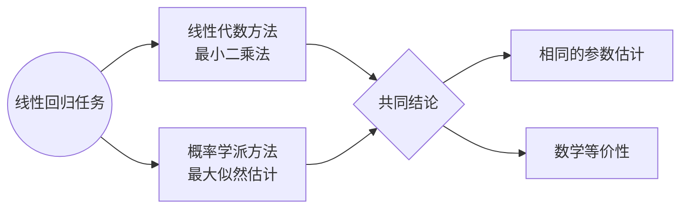

---

layout:    post
title:    "开始机器学习笔记的整理"
subtitle:    "目录"
date:    2026-07-05 13:00:00
author:    "lyn"
header-img: "img/post-bg-milkdragon-1.jpg"
catalog: true
tags: 
    - 机器学习
    - 有监督的机器学习
mathjax: true
mermaid: true

---

# 有监督的机器学习

>“吾日三省吾身：为人谋而不忠乎？与朋友交而不信乎？传不习乎？” ————《论语·学而》

一般意义上的机器学习试图解决这样一个问题：从给定的训练集$S_{train}=\{(y_n , x_n)\}$和函数空间$\{f_m(x)\}$中，挑选出一个最佳的函数$\hat{f}(x)$，使得：

1. 这个最佳的函数$\hat{f}(x)$在训练集上的 **“损失”** 要尽可能小；
2. 对于预测任务，即给定$\tilde{x}$，输出$\tilde{y}=\hat{f}(\tilde{x})$。在这个过程中，输出的$\tilde{y}$应该有一定的抗噪、可解释性以及泛化能力。

如果在训练$\hat{f}(x)$时，我们**同时**使用了自变量集（又称*特征集*）$\{x_n\}$ **和对应的因变量集**（又称*标签集*） $\{y_n\}$，那么我们称这种挑选最优函数的方式是**有监督的机器学习**。反之，若训练时只使用了特征集而不使用标签集，那么我们称这种挑选最优函数的方式是**无监督的机器学习**。

典型的有监督的机器学习有：线性回归、逻辑回归、支持向量机、各种经典树结构。典型的无监督的机器学习有：主成分分析（PCA）、强化学习、集成学习（如随机森林）等。

## 线性回归任务的结构

