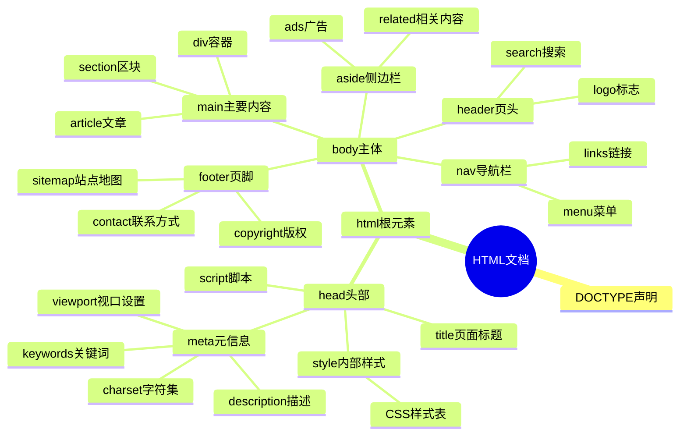

---

layout:    post
title:    "学习笔记"
subtitle:    "目录"
date:    2026-07-29 16:00:00
author:    "lyn"
header-img: "img/Aeneid.png"
catalog: true
tags: 
    - Flask
    - python
    - html
    - MySQL
mathjax: true
mermaid: true

---

<h1>Html、SQL和Flask的学习笔记</h1>

## 这是html5的学习笔记

### 一篇网页的主要构成部分：



### 重要的Annotations:

任何html文件在书写之前一定会加上这样的开头：

```html
<DOCTYPE HTML5>
<!--声明这是一个html5的文件，供浏览器渲染-->
<head>
<!--head里有多少元素我不管，但是在写整个html之前必定要加上以下语句：-->
<meta char="utf-8">
</head>
```


### 标题和区块

标题：

```html
<h1>这是一级标题</h1>
<h2>这是二级标题</h2>
<h3>这是三级标题</h3>
```

区块：

```html
<body>
    <div>
        这是行间区块，用"div"标签表示；
        div是division的缩写，没有任何特定语义。
        一个div独占一行。
    </div>
    <span>
        这是行内区块，用"span"标签表示；
        和div一样，也没有任何特定语义。
        多个span可以共享一行。
    </span>
</body>
```

### CSS修饰

**圆角**：

```html
<head>
    <style>
        .radius{
            height:10px;
            width:100px;
            border-radius:2px;
            /*border-radius在10/2px之内都可以起效果。
            当此值在5px时，边界正好被修改成圆形。*/
        }
    </style>
</head>

```

```html
<!--四个角分别用不同半径的圆角修饰-->
<head>
    <style>
        .radius{
            height:10px;
            width:100px;
            border-radius: 1px 1px 2px 5px;
              /* 分别代表左上、右上、右下、左下圆角的半径。 */
        }
    </style>
</head>
```

内边距

```html
<head>
    <style>
        .padding {
            height:10px;
            width:100px;
            background-color: pink;
            /* line-height:10px;文字垂直居中 */
            padding-left:20px;
        }
    </style>
</head>
```

```html
<head>
    <style>
        .padding {
            height:10px;
            width:100px;
            background-color: pink;
            /* line-height:10px;文字垂直居中 */
            padding: 10px 20px 20px 10px;
            /* 按“上，右，下，左”的顺序渲染 */
        }
    </style>
</head>
```

### SQL学习笔记

#### 引言：

SQL（Structured Query Language，结构化查询语言）是一种专门用于管理关系型数据库系统的标准化编程语言。它诞生于1970年代，由IBM公司的研究员Donald D. Chamberlin和Raymond F. Boyce基于E.F. Codd的关系模型理论开发而来。

**SQL的核心功能包括：**

- **数据查询（DQL）**：使用SELECT语句从数据库中检索数据
- **数据定义（DDL）**：使用CREATE、ALTER、DROP等语句定义和修改数据库结构
- **数据操纵（DML）**：使用INSERT、UPDATE、DELETE等语句增删改数据
- **数据控制（DCL）**：使用GRANT、REVOKE等语句控制数据访问权限

**SQL的特点：**

1. **声明式语言**：用户只需描述"要什么"，而不需要指定"怎么做"，数据库引擎会自动优化执行路径
2. **标准化**：由ANSI和ISO标准化，几乎所有主流数据库（MySQL、PostgreSQL、Oracle、SQL Server等）都支持
3. **非过程化**：不需要编写复杂的程序逻辑，通过简单的语句即可完成复杂的数据操作
4. **集合导向**：以集合论为基础，操作对象是数据集合而非单条记录

SQL已成为数据库领域的通用语言，是数据分析师、后端开发工程师、数据科学家等岗位的必备技能。

#### 基本语法：

```sql
USE my_database;
CREATE TABLE my_games (
游戏编号 INT PRIMARY KEY COMMENT "GAMES",
游戏名称 VARCHAR(35) COMMENT "NAME"
) COMMENT "These are my games";
```

如果想要删除上面创建的table和database，只需要分别进行以下操作：

```sql
DROP TABLE my_games;
DROP DATABASE my_database;
```

创建好一个带有表头的空表格之后，我们要填入表格信息。语法如下：

```sql
SHOW TABLES; --确认当前database里是否有你已经创建的表格
INSERT INTO my_games (游戏编号,游戏名称)
VALUES (1, 'assassins creed') , (2, 'rimworld') , (3, 'dancing line') , (4, 'resident evil') , (5, NULL);
```

注意，填入的信息的数量需要严格与表格创建时声明的表头的数量一致，否则会报错：

```txt
ERROR 1136 (21S01): Column count doesn't match value count at row
```

类型也必须与声明的类型一致，否则也会报错：

```txt
ERROR 1366 (HY000): Incorrect integer value: 'string' for column '游戏编号' at row 1
```

而我们的第一列声明该列储存INT类型。

第五行被我们设置成了NULL，也即空值类型。这是因为我暂时没有买那么多游戏。
而如果我又买进了鬼泣5这个游戏，现在想在原表格的基础上修改第五行对应的值，就可以使用SET...WHERE...的语法：

```sql
UPDATE my_games
SET 游戏名称 = 'devil may cry'
WHERE 游戏编号 = 5;
SELECT * FROM my_games;
SELECT 游戏名称 ， 游戏编号 FROM my_games
ORDER BY 游戏编号; --插入之后，按照游戏编号升序排列。
--若想降序排列，只需写作ORDER BY 游戏编号 DESC
```

---

#### Task:创建新表格并将其与旧表格合并

```sql
CREATE TABLE time_of_playing (
游戏编号 INT PRIMARY KEY COMMENT "in accordance with true index";
游玩时间 FLOAT COMMENT "time of playing a game, hour"
);
INSERT INTO time_of_playing (游戏编号,游玩时间)
VALUES (1, 120) , (2, 1000) , (3, 40) , (4, 70) , (5, NULL);
```

```sql
SELECT my_games.游戏编号 , my_games.游戏名称 , time_of_playing.游玩时间
FROM my_games
LEFT JOIN time_of_playing --如果想刨除空值，那么就采用INNER JOIN的写法
ON my_games.游戏编号 = time_of_playing.游戏编号;
SELECT * FROM my_games; --确认是否合并完成
```

---

#### 更多的数据基本操作：

```sql
SELECT COUNT(社团编号)
FROM students;
```

采用集合形式，刨除重复值和空值：

```sql
SELECT COUNT( DISTINCT 社团编号 )
FROM students
WHERE 社团编号 != NULL
ORDER BY 社团编号;
```


```sql
SELECT ROUND(AVG(成绩) , 2)
FROM students;--获取平均分，并保留两位小数
SELECT SUM(得分)
FROM players;--获取总分
SELECT MAX(成绩) , MIN(成绩)
FROM students;--获取最大值、最小值
```

```sql
SELECT AVG(成绩) AS 成绩平均 , MAX(成绩) AS 最高分 , MIN(成绩) AS 最低分
FROM students
GROUP BY 班级
ORDER BY (成绩平均) DESC;
```

进一步，根据已经筛选出来的结果，我们可以通过`HAVING`关键词来设置条件，进而筛选更多信息。
比如，我想筛选平均分大于80分的班级：

```sql
SELECT AVG(成绩) AS 成绩平均 , MAX(成绩) AS 最高分 , MIN(成绩) AS 最低分
FROM students
GROUP BY 班级
HAVING 成绩平均 >= 80
ORDER BY (成绩平均) DESC;
```


